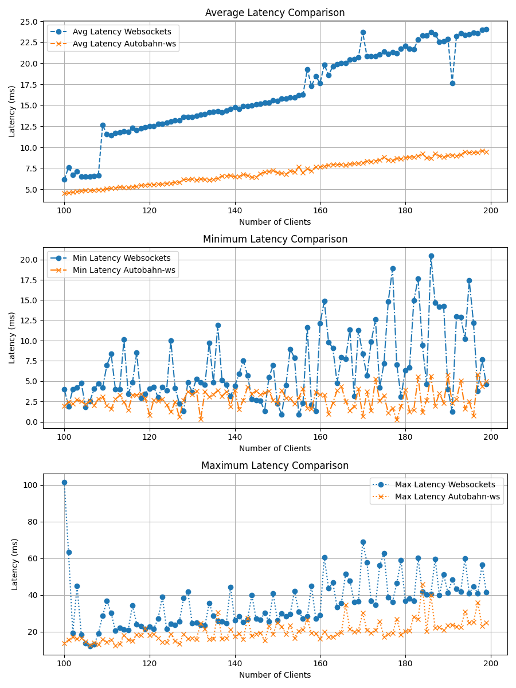
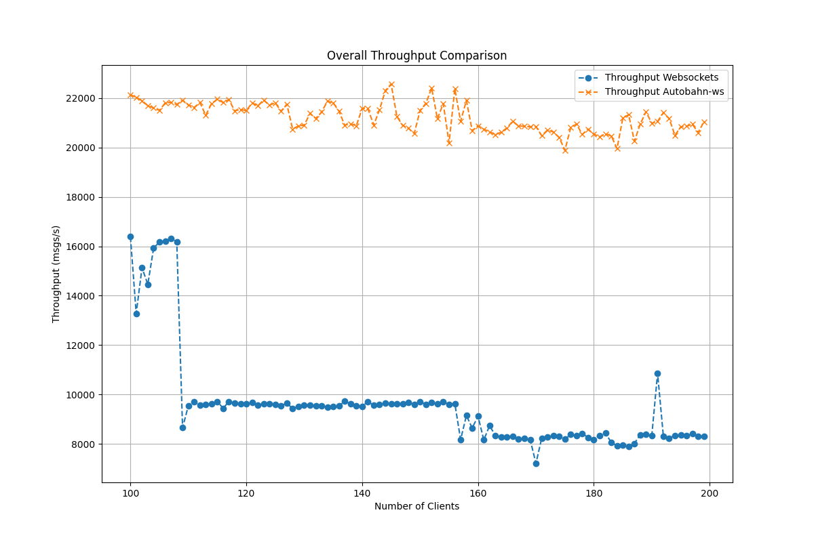
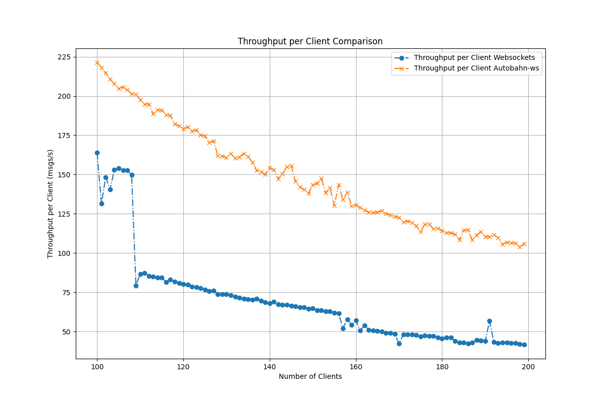

# Performance Evaluation Report: Websockets vs Autobahn-ws

## Introduction
This report presents a comparative analysis of the performance metrics between two WebSocket implementations: Websockets and Autobahn-ws. The performance evaluation is conducted based on latency and throughput metrics with varying numbers of clients. Both implementations are containerized using Docker, and resource limiting is applied to ensure fair comparison under controlled resource constraints.

## Methodology
I conducted experiments to measure the latency and throughput of both WebSocket implementations under different client loads. The experiments were performed on a MacBook Pro M1 Max with 32GB of memory. Both WebSocket implementations were containerized using Docker, and resource limiting was applied to ensure fair comparison under controlled resource constraints.

Given the hardware specifications of the MacBook Pro M1 Max, we set resource limits for each Docker container as follows:
- CPU was limited to 1 core.
- Memory was limited to 1GB.

## Latency Comparison
Latency, the time taken for a message to travel from the sender to the receiver, is a critical performance metric for WebSocket implementations. The latency comparison between Websockets and Autobahn-ws is depicted below:

### Observations:
- **Average Latency:** Websockets exhibit slightly higher average latency compared to Autobahn-ws across all client loads.
- **Minimum Latency:** Both implementations show similar minimum latency trends with increasing client loads.
- **Maximum Latency:** Websockets tend to have higher maximum latency compared to Autobahn-ws as the number of clients increases.

## Throughput Comparison
Throughput measures the rate at which messages are successfully transmitted over the WebSocket connection. The throughput comparison between Websockets and Autobahn-ws is illustrated below:

### Overall Throughput Comparison

### Throughput per Client Comparison

### Observations:
- **Overall Throughput:** Autobahn-ws demonstrates higher overall throughput compared to Websockets across different client loads.
- **Throughput per Client:** Autobahn-ws consistently delivers higher throughput per client compared to Websockets as the number of clients increases.

## Conclusion
Based on the performance evaluation, Autobahn-ws outperforms Websockets in terms of both latency and throughput metrics. Autobahn-ws exhibits lower latency and higher throughput, making it a more efficient choice for WebSocket-based applications, particularly under high client loads.

## Recommendations
- For applications prioritizing low latency and high throughput, Autobahn-ws is recommended over Websockets.

## References
- Tomasetti, Matt. (2021). An Analysis of the Performance of Websockets in Various Programming Languages and Libraries. 10.13140/RG.2.2.18552.57607.
- https://ville-karkkainen.medium.com/python-is-slow-wait-its-actually-fast-6d2e49621b1
